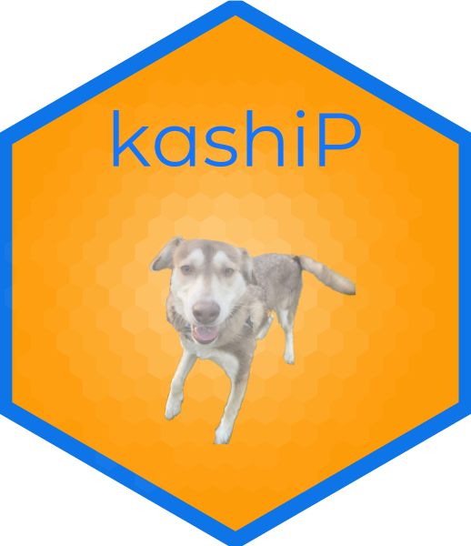

<!-- README.md is generated from README.Rmd. Please edit that file -->

```{r, include = FALSE}
knitr::opts_chunk$set(
  collapse = TRUE,
  comment = "#>",
  fig.path = "man/figures/README-",
  out.width = "100%"
)
```

# { kpthor } 

<!-- badges: start -->
[](https://lifecycle.r-lib.org/articles/stages.html#experimental)
[](https://github.com/mhdzy/kpthor/actions)
[](https://github.com/mhdzy/kpthor/actions)
[](https://codecov.io/gh/mhdzy/kpthor)
<!-- badges: end -->

# Overview

**kpthor** is a PWA that lets you track your dog's activity over time.

# Preqreqs

## R
This app requires `R (>= 4.0)`, available for download at https://cloud.r-project.org/. 

### pkgs
To run the app, a few R package dependencies are needed. These are documented in the `DESCRIPTION` file, but the code below will also install all packages (and their dependencies) imported (and suggested) by the app. 

``` r
deps_to_scan <- c("Imports", "Suggests")
uapply <- function(...) unlist(lapply(...))
libs_sub <- function(x) sub(" .*", "", trimws(stringi::stri_split(yaml::read_yaml("DESCRIPTION")[[x]], fixed = ",")[[1]]))
install.packages(uapply(deps_to_scan, libs_sub), dependencies = TRUE)
```

## DBMS
The app uses a database to store pets, actions, and events. The db interface functions are defined in `R/class_dbInterface.R`, and connection parameters are configured by the `golem_opts$dbi` field (see `R/run_app.R`). The DSN name is taken from the `inst/golem-config.yml` file, depending on which mode is set in `.Renviron`. 

The `dbInterface` class accepts two required initialization parameters, `drv` and `dsn`. These correspond to a database driver and a data source name (DSN). Currently, the app connects to a DSN named `KPthorSQL` using an `ODBC` driver.

Once the driver and DSN are configured on your machine, the database will need to then be loaded with tables that are required by the app. Functions to create these tables can be found in `R/class_dbInterface.R` with the `create_if_not_exist*()` naming pattern. 

todo: if no required tables are found, a local SQLite db is created to store info during each session

### system libraries
The following libraries are required for ODBC integration.

``` sh
sudo apt install -y unixodbc-dev odbcinst odbc-postgresql
```

### KPthorSQL
The DSN name used for production is `KPthorSQL`, but supports a `dev` mode which uses the `KPthorSQL-dev` DSN name. Add the following entry to `/etc/odbc.ini`, and fill in your specific connection details:

``` ini
[KPthorSQL]
Driver=PostgreSQL Default
Description=KPthorSQL DSN
User=my_database_username
Password=my_database_password
Database=apps
Server=192.168.0.xxx
Port=5432
```

### ODBC
The ODBC driver used Add the following entry to `/etc/odbcinst.ini`:

``` ini
[PostgreSQL Default]
Description=PostgreSQL ODBC driver
Driver=psqlodbcw.so
Setup=libodbcpsqlS.so
Debug=0
CommLog=1
FileUsage=1
Threading=2
UsageCount=1
```

# Installation

You can install the released version of **kpthor** from [GitHub](https://github.com/) with:

``` r
# install.packages("devtools")
devtools::install_github("mhdzy/kpthor")
```

You can also clone the **kpthor** source code by running:

``` zsh
git clone git@github.com:mhdzy/kpthor.git
```

# Run App

This is how you run the app locally:

```r
# library(kpthor)
kpthor::run_app()
```

# Host App

## Local

## Shiny Server

## RStudio Connect
